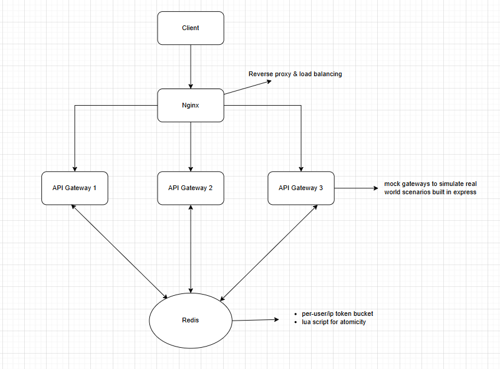

# 🚦 Distributed Rate Limiter

This project implements a **distributed rate limiting system** using **NGINX, Express, Redis, and Docker**.  
It ensures fair request handling across multiple API gateways with **token bucket algorithm**–based throttling.

---

## 📌 Features

- **Reverse Proxy & Load Balancing**: NGINX distributes incoming traffic across multiple API Gateways.  
- **Multiple API Gateways**: 3 mock API gateways built with **Express.js**.  
- **Shared Redis Database**: Centralized store for distributed rate limiting state.  
- **Token Bucket Algorithm**: Efficient, burst-friendly throttling mechanism.  
- **Two Types of Throttling**:
  - **IP-based throttling** for anonymous users.
  - **User-based throttling** for logged-in users.
- **Per-Bucket Isolation**: Each user or IP gets its own independent token bucket. ✅ (This is the correct and scalable way to do it.)  
- **Atomic Operations with Lua Scripts**: Ensures race-free token checks and refills across multiple gateways.  
- **Full Dockerization**: NGINX, Redis, and all API gateways run in containers.  
- **Simple Setup**: `docker-compose` and `Makefile` included for quick startup.

---

## 📐 Architecture



---

## ⚙️ Rate Limiting Logic

- **Algorithm**: Token Bucket
- **Operation**:
  - Each **user (authenticated)** or **IP (anonymous)** gets its own bucket.
  - Tokens are consumed on every request.
  - If bucket is empty → request is **throttled**.
  - Buckets are refilled at configurable rates.
- **Parameters**:
  - Anonymous (IP-based): `capacity = small`, `refillRate = slow`.
  - Logged-in (User-based): `capacity = larger`, `refillRate = faster`.

---

## 📂 Project Structure
```
├── nginx/ # NGINX config for reverse proxy + load balancing
├── api-gateway/ # Express.js mock API gateway code (shared for all 3)
│   ├── rateLimiter.js # Lua + Redis + Token Bucket implementation
│   └── server.js # Mock API endpoints
├── docker-compose.yml # Container orchestration
├── Makefile # Simple container startup helpers
└── README.md # Project documentation
```


---

## ▶️ Setup & Run

### 1. Prerequisites
- [Docker](https://www.docker.com/)  
- [Docker Compose](https://docs.docker.com/compose/)  
- GNU `make`

### 2. Build the images & start
```bash
make build
```

### 3. Stop the containers
```bash
make down
```

